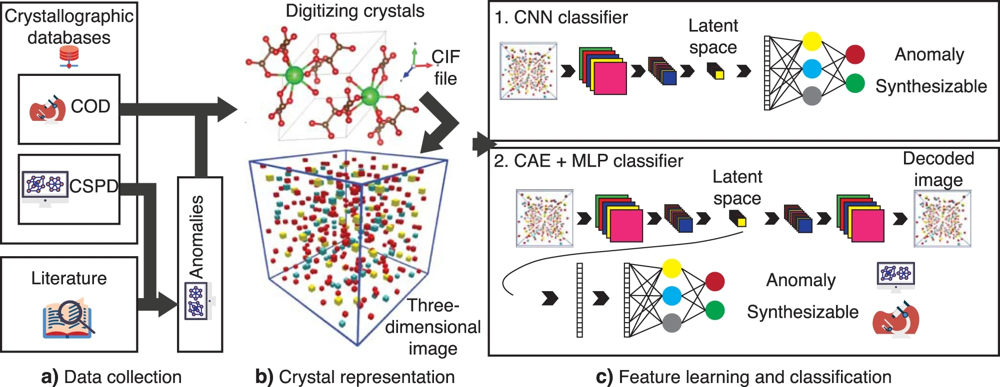
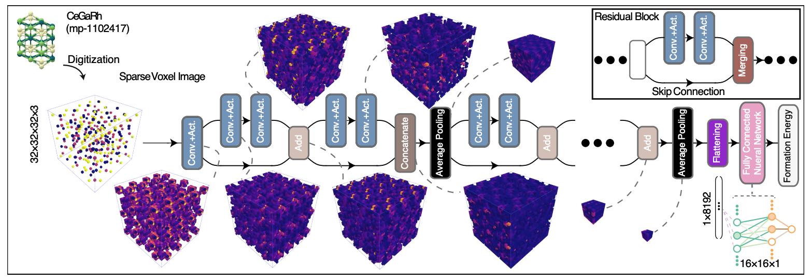
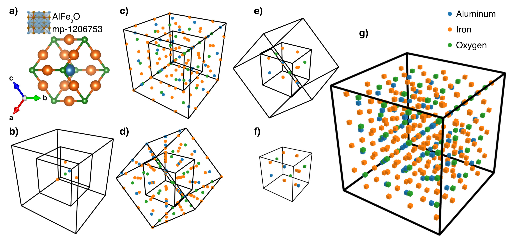

# XIE-SPP: Crystal Image Encoder for Synthesis & Property Prediction

[LICENSE](https://creativecommons.org/licenses/by-nc-sa/4.0/deed.en)

This code has been developed by **Ali Davariashtiyani**. ([LinkedIn](https://www.linkedin.com/in/davari-ali/), [Scholar](https://scholar.google.com/citations?user=4_t-DZYAAAAJ&hl=en))

This code has been developed under the support of the National Science Foundation (NSF) award number DMR-2119308.

## 1. Reference

Please cite the following paper if you use any part of our code or data: 

Davariashtiyani, A., Kadkhodaie, Z. & Kadkhodaei, S. Predicting synthesizability of crystalline materials via deep learning. *Commun Mater* **2**, 115 (2021). [https://doi.org/10.1038/s43246-021-00219-x](https://doi.org/10.1038/s43246-021-00219-x)



The data files for this paper is available at [https://uofi.app.box.com/s/7o39i8jt4ve7s5loo0twlub06k3d7np3](https://uofi.app.box.com/s/7o39i8jt4ve7s5loo0twlub06k3d7np3)


Ali Davariashtiyani, Sara Kadkhodaei. Formation energy prediction of crystalline compounds using deep convolutional network learning on voxel image representation.  *Commun Mater* **2**, 105 (2023). [https://doi.org/10.1038/s43246-023-00433-9](https://doi.org/10.1038/s43246-023-00433-9)



> **Update (Sep 24, 2026):** new installation with `uv` (recommended) or conda, a new `xiespp` command line tool,
> updated example notebooks, and fixes for installation errors.

## 2. Installation
Tested on Ubuntu 20.04 with Python 3.10 (supported: Python 3.10 – 3.11, TensorFlow/Keras 2.12 – 2.15).

The package **must be installed** (importing it from the cloned folder is not enough).

Two installation options are available:
- **Core** (`.`): everything needed to make predictions from structure files (all models and the `xiespp` command), and CVR image creation/visualization (plotly).
- **Dev** (`.[dev]`): core + Jupyter, static figure export (kaleido), Materials Project API and PyMatGen, needed for the example notebooks.

```sh
git clone https://github.com/kadkhodaei-research-group/XIE-SPP.git
cd XIE-SPP/
```

### Option A: uv (recommended)
Install [uv](https://docs.astral.sh/uv/getting-started/installation/), then:
```sh
uv sync                  # core
# or
uv sync --extra dev      # dev
# add --extra gpu for NVIDIA GPU support on Linux, e.g. uv sync --extra dev --extra gpu

source .venv/bin/activate
```
`uv sync` creates `.venv` with Python 3.10 and the exact, tested package versions from `uv.lock`.

### Option B: conda / mamba
```sh
conda env create -f environment.yml   # or: mamba env create -f environment.yml
conda activate xiespp
pip install -e ".[dev]"               # optional: dev
```

### Google Colab
```sh
!git clone https://github.com/kadkhodaei-research-group/XIE-SPP.git
!pip install -e XIE-SPP
```
Then restart the runtime (*Runtime → Restart session*) before importing `xiespp`.

### Notes
- GPU (Linux): `uv sync --extra gpu` (or `pip install -e ".[gpu]"`). The models run on CPU by default; use `--device /device:GPU:0` (CLI) or `device='/device:GPU:0'` (Python).
- Exporting static figures (`fig.write_image(...)`, `fig.show(renderer="png")`) needs Chrome for kaleido: run `plotly_get_chrome`. Interactive figures (`fig.show()`) do not need it.

## 3. Command line interface
After installation the `xiespp` command is available. Inputs are CIF files by default (use `--format vasp` etc. for other [ASE formats](https://wiki.fysik.dtu.dk/ase/ase/io/io.html)); `--test` runs on the example structures shipped with the package.

```sh
# Synthesizability likelihood, version 2 (default, recommended)
xiespp synthesizability structure1.cif structure2.cif -o synthesizability.csv

# Synthesizability, version 1 (CNN or CAE-MLP classifier)
xiespp synthesizability *.cif --model v1-cae-mlp
xiespp synthesizability *.cif --model v1-cnn

# Formation energy (eV/atom)
xiespp formation-energy *.cif -o formation_energy.csv
```

Predictions are printed and optionally saved (`-o`) as CSV:
```
file,synthesizability
GaN_12.cif,0.2446
GaN_9.cif,0.8109
```

Useful options: `-e/--ensemble` number of rotational ensembles (default: 100 for synthesizability, 50 for formation energy), `-b/--batch-size`, `--device`, `-v` (progress). See `xiespp <command> -h` for all options.

## 4. Using the models in Python
### 4.1 Synthesizability prediction (Version 2)
We highly encourage the use of this version of the model.
This version is more robust, accurate and faster than the previous version.
```python
from xiespp import synthesizability, get_test_samples
# or
# from xiespp import synthesizability_2 as synthesizability

samples = get_test_samples('CSi')
# The input to the model can be in formats like: CIF, POSCAR, PyMatGen Structure, ASE Atoms
model = synthesizability.SynthesizabilityPredictor()
model.predict(samples)
```

### 4.2 Synthesizability prediction (Version 1)
```python
from xiespp.synthesizability_1 import synthesizability

samples = synthesizability.get_test_samples('GaN')  # [.../GaN_12.cif, .../GaN_9.cif]
# Input can be CIF files or ASE Atoms objects
synthesizability.synthesizability_predictor(samples)
```

The output is the synthesizability likelihood of the input list:
```
array([0.96435136, 0.00200528], dtype=float32)
```

### 4.3 Formation energy prediction
```python
from xiespp import formation_energy, get_test_samples

samples = get_test_samples('MoS2')
# The input to the model can be in formats like: CIF, POSCAR, PyMatGen Structure, ASE Atoms
model = formation_energy.FormationEnergyPredictor()
model.predict(samples)  # formation energy (eV/atom)
```
For more options (image generator, all ensemble predictions, Materials Project structures) see [example_formation_energy.ipynb](example_formation_energy.ipynb).

### 4.4 Crystal Voxel Representation (CVR) 3D images
Converting a CIF file to a 3D image (NumPy array) with arbitrary size, resolution and channels,
and visualizing it with plotly. See [example_cvr_images.ipynb](example_cvr_images.ipynb) for the full example.
```python
import numpy as np
from xiespp import CVR, get_test_samples

atoms = CVR.crystal_parser(filepath=get_test_samples('GaN')[0])
image = CVR.ThreeDImage(
    atoms=atoms,
    box=CVR.BoxImage(box_size=20, n_bins=64),       # 20 A box, 64^3 voxels
    channels=['atomic_number', 'group', 'period'],  # any subset/order of these channels
    filling='fill-cut',
)
array = image.get_image()                           # shape: (64, 64, 64, 3)
np.save('GaN.npy', array)

CVR.vv.voxel_interactive_plotly(array, channels=0, box_outline=True).show()
```

Example notebooks: [example_synthesizability.ipynb](example_synthesizability.ipynb), [example_formation_energy.ipynb](example_formation_energy.ipynb), [example_cvr_images.ipynb](example_cvr_images.ipynb) (require the dev installation).

## 5. Reproducibility
### 5.1 Unpacking the data files
Data files:
- Synthesizability prediction: [https://uofi.app.box.com/s/7o39i8jt4ve7s5loo0twlub06k3d7np3](https://uofi.app.box.com/s/7o39i8jt4ve7s5loo0twlub06k3d7np3)
- Formation energy prediction: [https://uofi.box.com/s/ka69pgrpgn9gkauz912urcurj31xmlfm](https://uofi.box.com/s/ka69pgrpgn9gkauz912urcurj31xmlfm)

Untarring the files to the data folder:
```sh
tar -xvzf Data.joined.tar.gz
```
### 5.2 Data availability
All the CIF files are collected from the [Materials Project](https://materialsproject.org/), [COD](http://www.crystallography.net/cod/) and [CSPD](https://github.com/SUNCAT-Center/AtomicStructureGenerator) databases. The selected data fed to the model is available in the unwrapped data folder.

### 5.3 Preparing data from the scratch
All the used data is already prepared in the unwrapped folder. However, for reproducing everything again, follow the steps:
Set the data folders in the [config.py](https://github.com/kadkhodaei-research-group/NN-crystal-synthesizability-predictor/blob/main/config.py) file. 
1. Prepare the positive set:
Obtain the [COD](https://wiki.crystallography.net/howtoobtaincod/):
```sh
mkdir data/data_bases/
wget http://www.crystallography.net/archives/cod-cifs-mysql.tgz
tar -xvzf cod-cifs-mysql.tgz
```
Follow [the guideline](https://github.com/kadkhodaei-research-group/NN-crystal-synthesizability-predictor/blob/main/positive_data_preparation.ipynb) to create the SQL file. 

Run the entire [positive_data_preparation.ipynb](https://github.com/kadkhodaei-research-group/NN-crystal-synthesizability-predictor/blob/main/positive_data_preparation.ipynb) file.

2. According to the prepared guideline to prepare the CSPD data set and run [anomaly_generation.ipynb](https://github.com/kadkhodaei-research-group/NN-crystal-synthesizability-predictor/blob/main/anomaly_generation.ipynb) to prepare the negative set
3. Create the image files by running [data_set_selections.ipynb](https://github.com/kadkhodaei-research-group/NN-crystal-synthesizability-predictor/blob/main/data_set_selections.ipynb)

### 5.4 Re-training the models
<!-- 1. To re-train the CNN visit: [train_cnn_d9_encoder_1_r3.ipynb](https://github.com/kadkhodaei-research-group/NN-crystal-synthesizability-predictor/blob/main/train_cnn_d9_encoder_1_r3.ipynb)
2. To re-train the CAE-MLP visit: [train_cae_mlp_d9_encoder_9.ipynb](https://github.com/kadkhodaei-research-group/NN-crystal-synthesizability-predictor/blob/main/train_cae_mlp_d9_encoder_9.ipynb) -->
Re-training formation energy prediction: [model7_training.ipynb](https://github.com/kadkhodaei-research-group/XIE-SPP/blob/main/training/formation-energy/training/model7_training.ipynb)


## 6. Crystal Voxel Representation (CVR) 3D images

Image creation package: [CVR](https://github.com/kadkhodaei-research-group/XIE-SPP/tree/main/xiespp/CVR)



